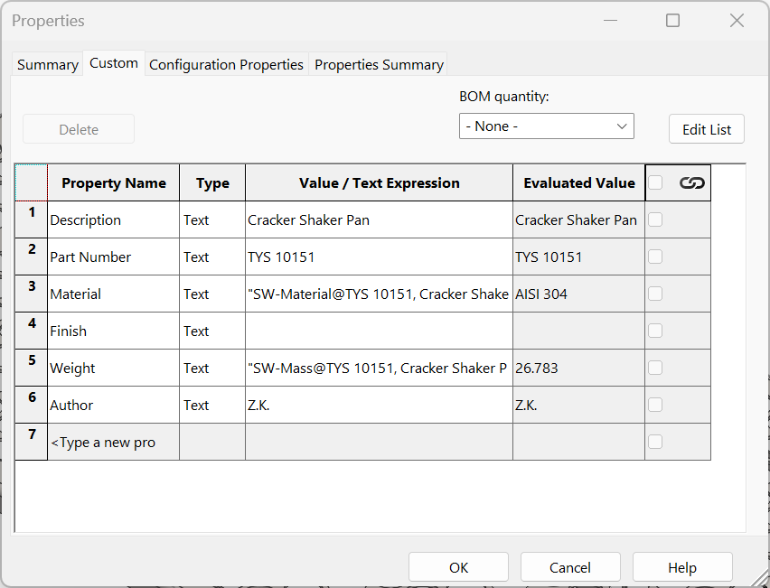
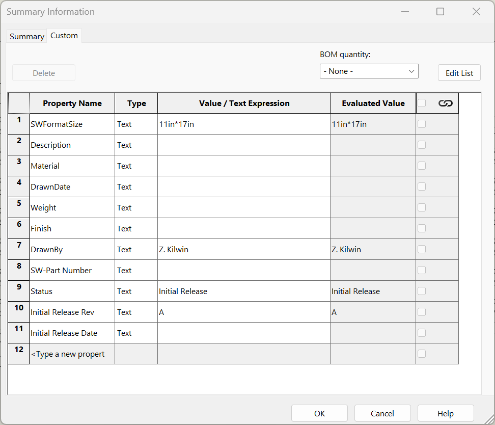
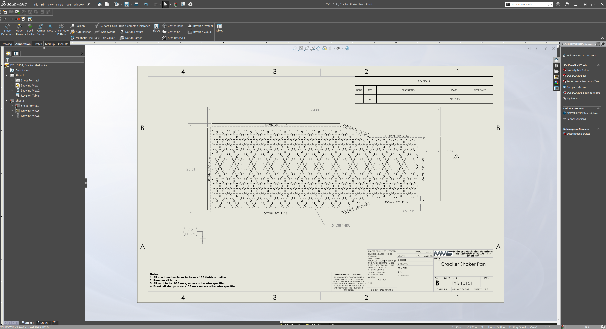
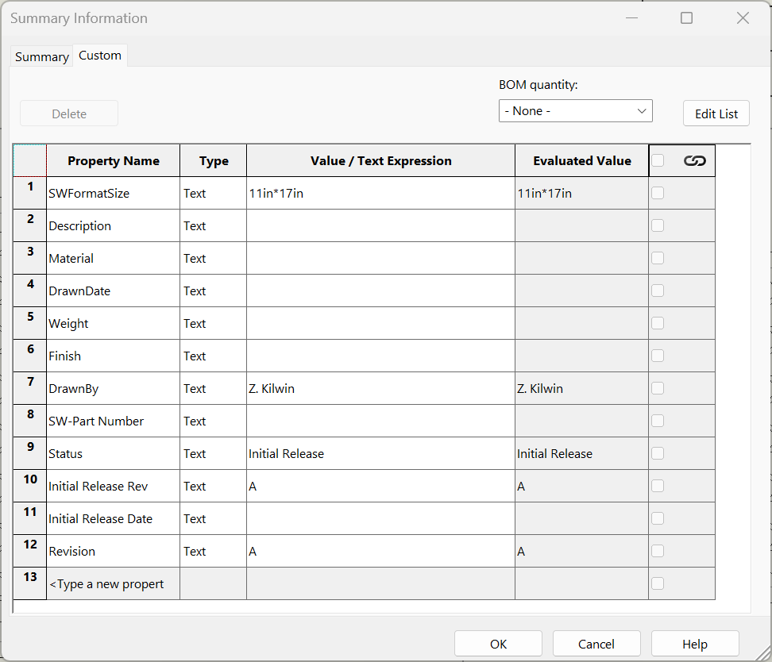
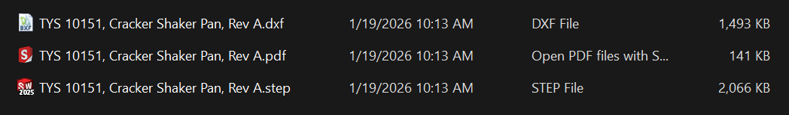

# Advanced File Output Macro

This SolidWorks VBA macro automates the export of the active drawing and its referenced model to multiple file formats, using custom properties for intelligent filename generation.

## Quick download (for SolidWorks users)

If you just want the macro file (no GitHub knowledge needed):

- **Download the macro (.swp):**
  https://github.com/kilwizac/sw-advanced-output/raw/main/Advanced%20File%20Output.swp

**Tip:** If the link opens in your browser instead of downloading, **right‑click → “Save link as…”** (or similar) to save the `.swp` file.

## Features

- **Drawing Export**: Exports the current drawing to DXF (with company-wide preferences) and PDF formats.
- **Model Export**: Exports the referenced part or assembly to STEP format.
- **Smart Filenames**: Constructs filenames using custom properties (Part Number, Description, and optional Revision) from the model and drawing.
- **Filename Sanitization**: Automatically cleans filenames to ensure Windows compatibility by replacing invalid characters.
- **Overwrite Protection**: Checks for existing files and prompts the user before overwriting.
- **Error Handling**: Validates exports and reports success or failure with detailed messages.

## Usage

1. **Prerequisites**:
   - SolidWorks must be installed and running.
   - Open a drawing document that references a part or assembly.
   - Ensure the drawing is saved to disk.
   - The referenced model must have "Part Number" and "Description" custom properties set. "Revision" is optional (from the drawing).

   
   *The macro pulls "Part Number" and "Description" from the referenced Model's Custom Properties.*

   
   *Revision information is pulled from the Drawing. Note: If a revision table has not been added to the drawing, the macro will output filenames without revision levels.*

   
   *Adding a Revision Table to the drawing automatically populates the "Revision" property.*

   
   *Once the Revision Table is present, the "Revision" custom property is updated.*

2. **Running the Macro**:
   - Load and run `Advanced File Output.swp` in SolidWorks.
   - The macro will automatically detect the referenced model and export files to the same folder as the drawing.

   
   *Example of exported files including the revision level (e.g., ", Rev A") in the filename.*

3. **Output Files**:
   - `<Part Number>, <Description>[, Rev <Revision>].dxf` (drawing)
   - `<Part Number>, <Description>[, Rev <Revision>].pdf` (drawing)
   - `<Part Number>, <Description>[, Rev <Revision>].step` (model)

## Installation

1. Download `Advanced File Output.swp` using the **Quick download** link above.
2. In SolidWorks, go to **Tools → Macro → Run…** and select the `.swp` file.
3. For persistent access, you can assign it to a toolbar button or menu.

## Requirements

- SolidWorks 2013 or later (due to DXF format version).
- VBA support enabled in SolidWorks.

## Notes

- The macro temporarily modifies DXF export preferences but restores them afterward.
- If no referenced model is found or required properties are missing, the macro will display an error and exit.
- All exports must succeed for the macro to complete; otherwise, it stops at the first failure.

## Contributing

Feel free to fork and improve the macro. Pull requests are welcome.
