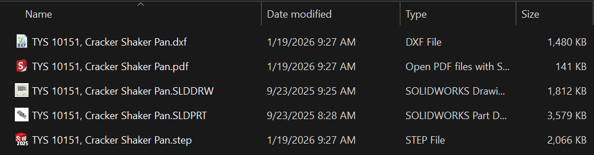

# Advanced File Output Macro

This SolidWorks VBA macro automates the export of the active drawing and its referenced model to multiple file formats, using custom properties for intelligent filename generation.

## Quick download (for SolidWorks users)

If you just want the macro file (no GitHub knowledge needed):

- **Download the macro (.swp):**
  https://github.com/kilwizac/sw-advanced-output/raw/main/Advanced%20File%20Output.swp

**Tip:** If the link opens in your browser instead of downloading, **right‑click → “Save link as…”** (or similar) to save the `.swp` file.

## Features

- **Drawing Export**: Exports the current drawing to DXF (with company-wide preferences) and PDF formats.
- **Model Export**: Exports the referenced part or assembly to STEP format.
- **Smart Filenames**: Constructs filenames using custom properties (Part Number, Description, and optional Revision) from the model and drawing.
- **Filename Sanitization**: Automatically cleans filenames to ensure Windows compatibility by replacing invalid characters.
- **Overwrite Protection**: Checks for existing files and prompts the user before overwriting.
- **Error Handling**: Validates exports and reports success or failure with detailed messages.

## Usage

### 1. Prerequisites (No Revision)

The macro pulls the "Part Number" and "Description" from the referenced model's custom properties.

*1. Model Custom Properties: Ensure "Part Number" and "Description" are set.*

If no revision table is present, the drawing's custom properties will not contain a "Revision" field.

*2. Drawing Custom Properties: Without a revision table, no revision is pulled.*

Running the macro in this state will output files without revision levels.

*3. Output: Filenames are generated using only Part Number and Description.*

---

### 2. Adding Revisions

To include a revision level in the filename, add a **Revision Table** to the drawing.

*1. Revision Table: Adding the table to the drawing.*

Adding the table automatically populates the "Revision" property in the drawing's custom properties.

*2. Drawing Properties: The "Revision" property is now available.*

The macro detects this property and appends it to the filename.

*3. Output: Filenames now include the revision level (e.g., ", Rev A").*

## Installation

1. Download `Advanced File Output.swp` using the **Quick download** link above.
2. In SolidWorks, go to **Tools → Macro → Run…** and select the `.swp` file.
3. For persistent access, you can assign it to a toolbar button or menu.

## Requirements

- SolidWorks 2013 or later (due to DXF format version).
- VBA support enabled in SolidWorks.

## Notes

- The macro temporarily modifies DXF export preferences but restores them afterward.
- If no referenced model is found or required properties are missing, the macro will display an error and exit.
- All exports must succeed for the macro to complete; otherwise, it stops at the first failure.

## Contributing

Feel free to fork and improve the macro. Pull requests are welcome.
